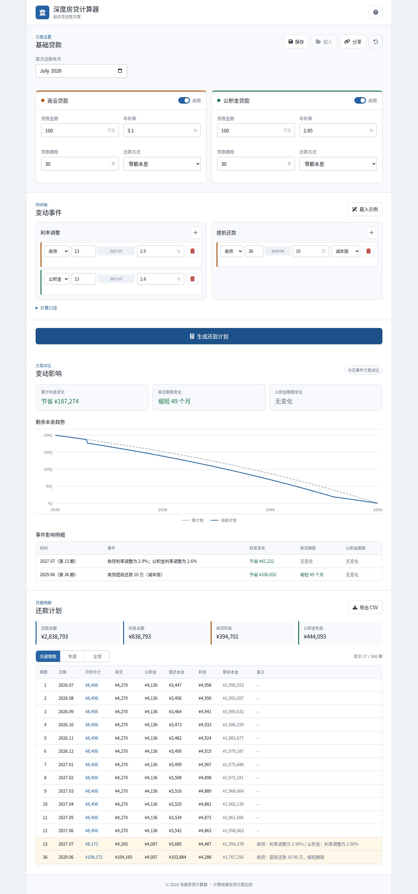

<div align="center">
  <h1>深度房贷计算器 · Deep Mortgage Calculator</h1>
  <p>支持组合贷、利率调整和提前还款的纯前端还款方案计算器。</p>
  <p><a href="https://SeanWong17.github.io/Deep-Mortgage-Calculator/">在线使用</a></p>
</div>

## 页面预览



## 功能

- 商业贷款和公积金贷款可分别启用并设置金额、利率、期限及还款方式
- 支持等额本息、等额本金和零利率场景
- 支持多次利率调整与提前还款
- 提前还款可选择减少月供或缩短期限
- 对比无事件原计划，展示利息和期限变化
- Canvas 剩余本金趋势图与完整月度还款计划
- 关键期数、年度、全部三种表格视图
- CSV 导出、浏览器本地保存和方案链接分享
- 输入范围、同月重复事件和停用贷款事件校验
- 键盘操作、弹窗焦点管理、屏幕阅读器标签和减少动画支持

## 计算口径

系统按月模拟，每一期固定采用以下顺序：

1. 应用当期利率调整。
2. 按当前剩余本金、利率和期限支付正常月供。
3. 正常月供后执行当期提前还款。
4. 减少月供或缩短期限从下一期开始生效。

每期利息、本金和月供均按人民币分四舍五入，最后一期结清剩余本金。等额本息的零利率场景按剩余本金平均分摊。

本工具不包含按日计息、具体重定价日、违约金、最低提前还款金额、次数限制等银行规则。结果用于方案比较，不替代贷款合同或银行账单。

## 项目结构

```text
Deep-Mortgage-Calculator/
├── index.html                 页面结构与可访问语义
├── style.css                 响应式样式
├── loan-engine.js            纯贷款计算引擎
├── validation.js             场景校验与参数转换
├── renderers.js              表格、分析、图表和 CSV
├── app.js                    页面状态与交互
├── tests/                    计算和校验单元测试
├── e2e/                      Playwright 浏览器流程测试
├── playwright.config.js
└── package.json
```

页面运行不依赖 Node.js 或构建工具，直接打开 `index.html` 即可。Font Awesome 通过带完整性校验的 CDN 加载；图标加载失败不会影响计算。

## 开发与验证

需要 Node.js 18 或更高版本。

```bash
npm ci
npx playwright install chromium
npm run verify
```

也可以分别运行：

```bash
npm run check
npm test
npm run test:e2e
```

测试覆盖标准还款、零利率、等额本金、两种提前还款策略、全额提前还款、同月事件顺序、非法输入、重复事件以及桌面和移动端主要流程。

## 隐私

所有计算均在浏览器本地完成。保存方案使用浏览器 `localStorage`，分享方案会把输入编码到 URL 中，项目不上传贷款数据。

## 许可

项目当前沿用 [CC BY-NC-SA 4.0](https://creativecommons.org/licenses/by-nc-sa/4.0/)：允许署名分享和修改，不允许商业使用，衍生作品需采用相同许可。
